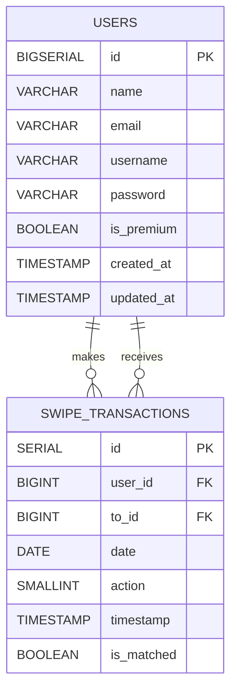
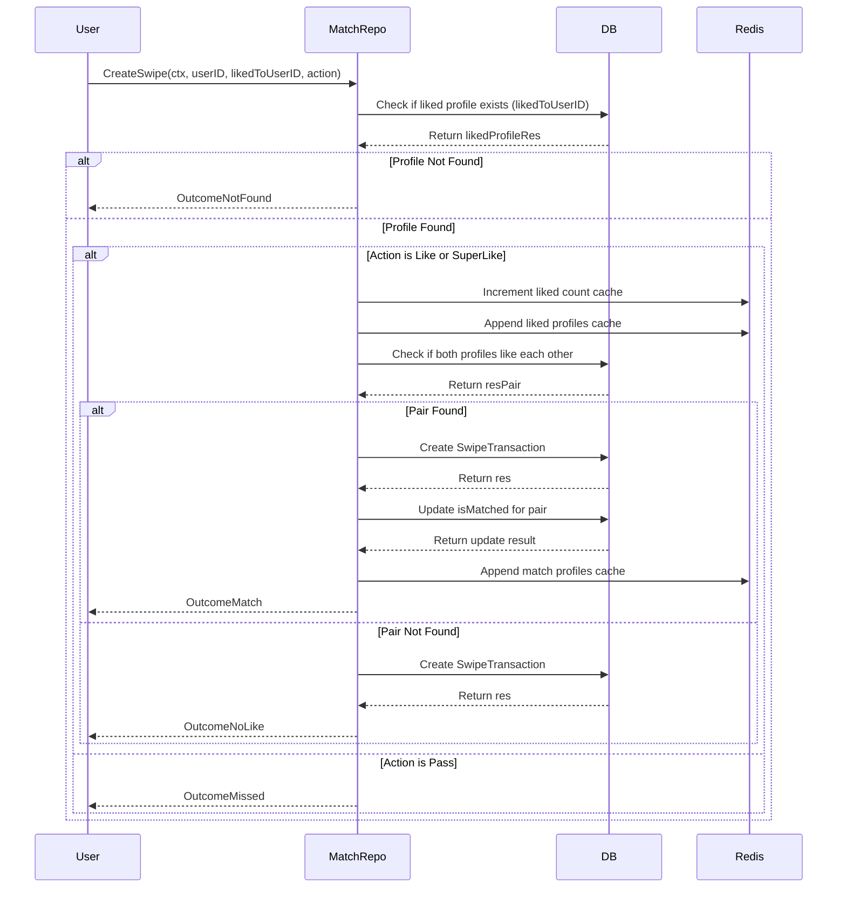
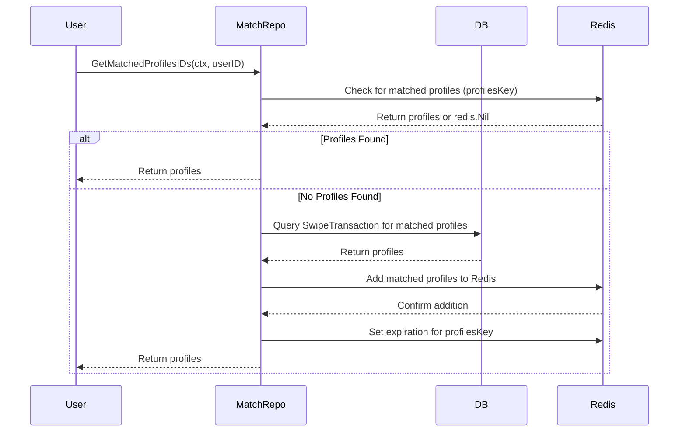
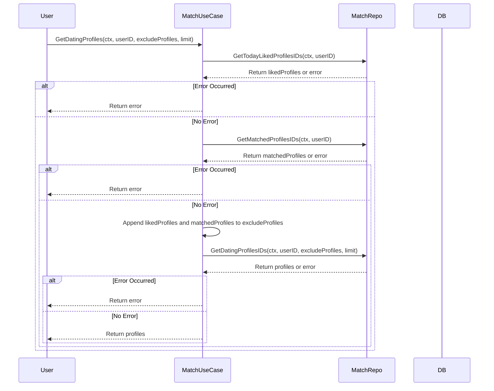
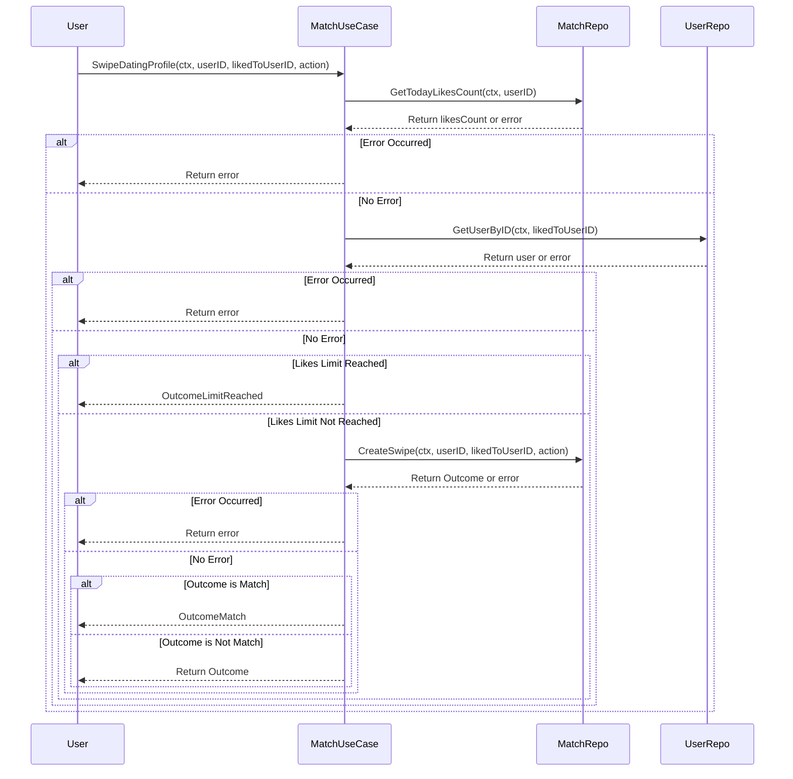

# dating-app
A dating app backend service using golang, utilize Echo for routing, GORM for ORM, PostgreSQL as the database, and Redis for caching.

Repository URL : https://github.com/ghaniswara/dating-app

## Server Structure
- /internal/config : Configuration Loader for the Server
- /internal/routes : Routes for the Server
  - /v1/auth : Authentication Routes
  - /v1/match : Match Routes
- /internal/usecase
  - /auth : Authentication Usecases
  - /match : Match Usecases
- /internal/middleware : Middleware for the Server
- /internal/repository : Repositories for the Server
- /internal/entity : which consist of following entities
   - repository
   - request
   - response
- /pkg/http_util : HTTP Utility for the Server
- /pkg/jwt : JWT Utility for the Server
- /pkg/path : Utility for searching path used by the Config Loader & Test Helper
- /test/auth : Authentication Test
- /test/helper : Test Helper
- /test/match : Match Test

## Instruction to Run the Service
1. Clone the repository
2. Install the dependencies using `go mod tidy`
3. Setup the environment variables using `cp .env.example .env`
4. Install [golang-migrate](https://github.com/golang-migrate/migrate) by following the instruction on the website
4. Run migration using [golang-migrate](https://github.com/golang-migrate/migrate) 
    ```
    `$ migrate -source ./migrations/ -database postgres://localhost:<YOUR-PORT>/database up 2`
    ```
4. Run the server using `go run . dev`

## Functional & Non-Functional Requirements
### Functional Requirements
1. Endpoint to register a new user
2. Endpoint to login
3. Endpoint to get dating profiles
    - It should accept a list of excluded profiles ID
    - It should not return a same profile which has been swiped by the user on that day
    - It should not return a profile which has been matched with the user
4. Endpoint to swipe dating profile
    - It should accept a profile ID and action (like or pass)
    - It should return a outcome of the swipe
    - If user swipe like more than 10 times, user shouldn't be able to swipe like anymore

### Non-Functional Requirements
1. User can likes and pass other users
2. User can likes up to 10 times for free, if user want to increase the limit, user need to buy the premium subscription
3. User will only see dating profile that they haven't swiped yet
4. When like a profile which like back, user will notified immediately
5. When user pass a profile which likes the user back, user will notified immediately that he missed the chance to match with that profile
6. When a user swipe like more than 10 times, user shouldn't be able to perform any like action but can still pass other users

## Stacks
- Golang
    
    The ease of use of goroutine which allows for us to utilize the distributed processing for future development, which is critical for the scalability of the service, in distributed system which needs to handle a large number of requests per seconds.

    Golang is a simple language which similar to C, which is developer friendly and easy to understand.
- Echo Router
    
    Based on benchmark from from techempower JSON Serialization benchmark ehco is one of the fastest compared to chi and golang stardard library, a hight throughput is critical for an application such as tinder, which needs to handle a lot of RPS

    Echo is also compatible with the standard go net/http library, which gives flexibility for developers

    https://www.techempower.com/benchmarks/#hw=ph&test=json&section=data-r22&l=zijocf-cn3
- PostgreSQL
    
    PostgreSQL offer extensive support for SQL and it's a battle-tested database which is used by many big companies, which ensures that the database part of the service is reliable and scalable.

    Postgres Extension such as 
        - pg_partman for partitioning the table for better performance and easier backup.
        - pg_mq for message queueing which can be used to handle the event when user liked or passed a profile. in the early phase of the development
        - pg_cron for scheduling the task to run periodically.

    furthermore supabase involvement in the Package manager [database.dev](database.dev) which will alow tons of community support for the database ecosystem.
- Redis
    
    Redis is used to cache the most frequently accessed data from the database, which will improve the performance of the service.

## ER Diagram


## Sequence Diagram

### Match Repository
* Create Swipe Transaction


* Get Matched Profiles IDs

### Match Usecase
* Get Dating Profiles


* Swipe Dating Profile


## Test Cases