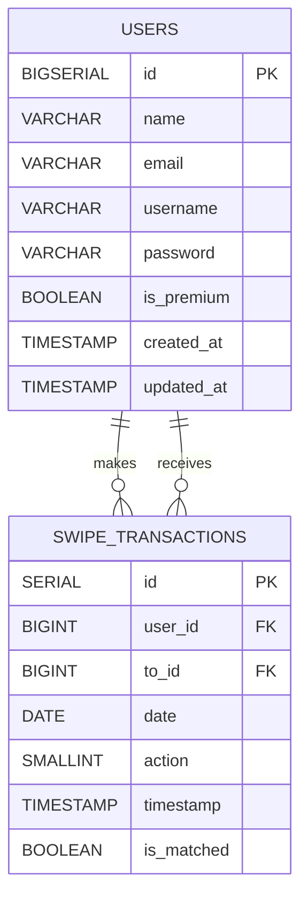

# dating-app
A dating app backend service using golang, utilize Echo for routing, GORM for ORM, PostgreSQL as the database, and Redis for caching.

## Server Structure
- /internal/config : Configuration Loader for the Server
- /internal/routes : Routes for the Server
  - /v1/auth : Authentication Routes
  - /v1/match : Match Routes
- /internal/usecase
  - /auth : Authentication Usecases
  - /match : Match Usecases
- /internal/middleware : Middleware for the Server
- /internal/repository : Repositories for the Server
- /internal/entity : which consist of following entities
   - repository
   - request
   - response
- /pkg/http_util : HTTP Utility for the Server
- /pkg/jwt : JWT Utility for the Server
- /pkg/path : Utility for searching path used by the Config Loader & Test Helper
- /test/auth : Authentication Test
- /test/helper : Test Helper
- /test/match : Match Test

## Instruction to Run the Service
1. Clone the repository
2. Install the dependencies using `go mod tidy`
3. Setup the environment variables using `cp .env.example .env`
4. Install [golang-migrate](https://github.com/golang-migrate/migrate) by following the instruction on the website
4. Run migration using [golang-migrate](https://github.com/golang-migrate/migrate) 
    ```
    `$ migrate -source ./migrations/ -database postgres://localhost:<YOUR-PORT>/database up 2`
    ```
4. Run the server using `go run . dev`

## ER Diagram
